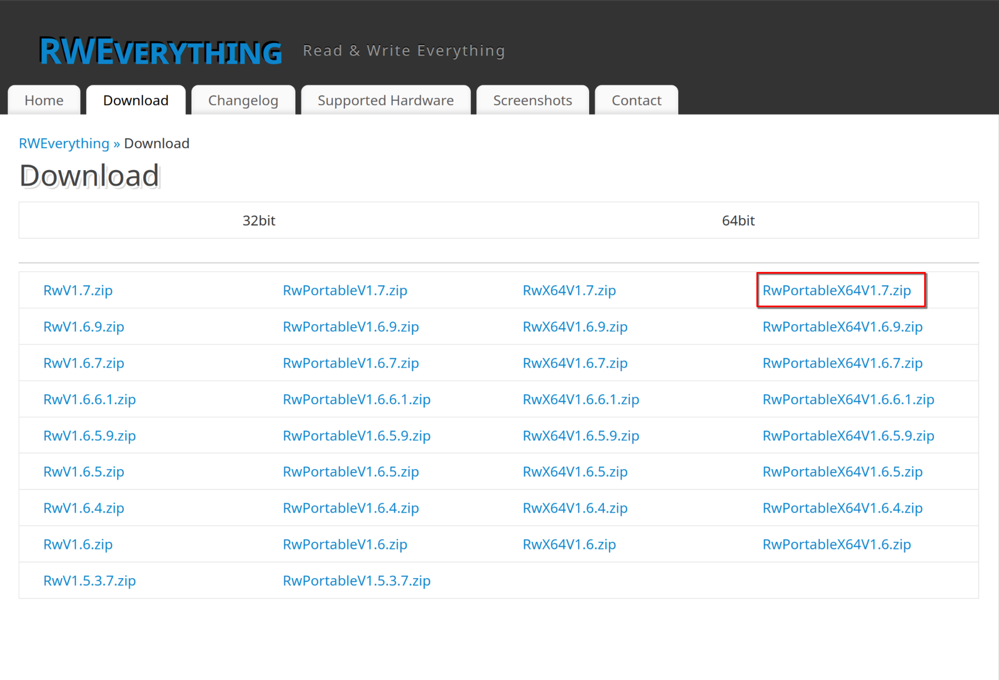
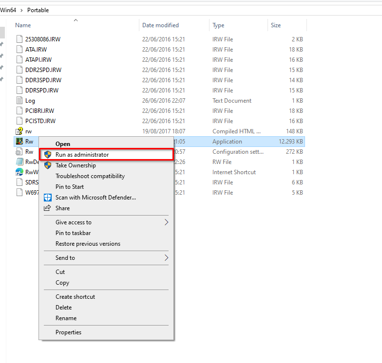
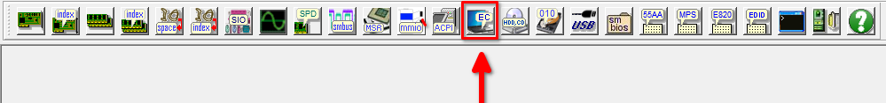
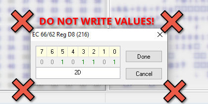
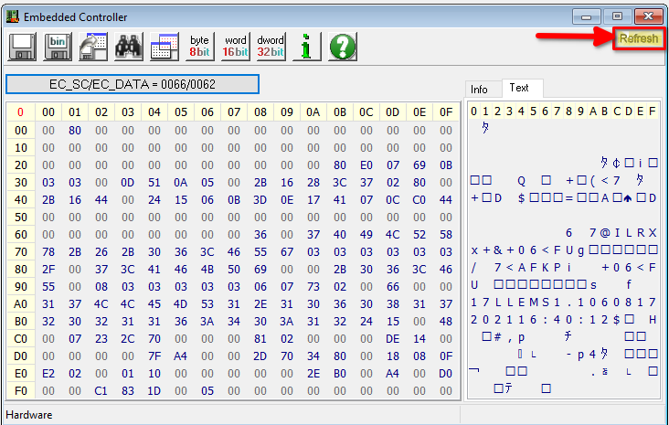
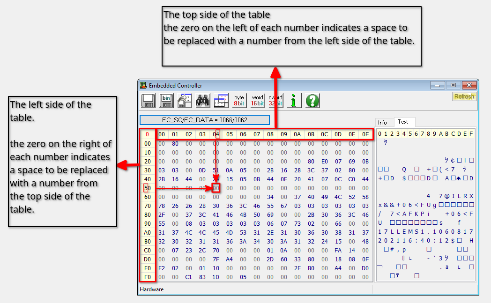

# Intro
There are two main methods to get your MSI laptop supported: the recommended method requires Windows to be installed, and the other works directly on Linux.

> [!IMPORTANT]
> If there are any BIOS/firmware updates available for your laptop, follow this guide for your current firmware before installing any of them. Then repeat the process for each new firmware version you install from the official MSI website. This is required to obtain support for older firmware as the EC configuration may vary across the versions.

> [!TIP]
> Before you proceed, you should get familiar with resetting the BIOS and the EC. If you don't already know how to do it, now it's the time to learn.
# Table of contents

+ [Windows](#windows-method-recommended)
  + [RWE guide](#windows-method-recommended)
  + [MsiEcRamEditor](https://github.com/timschneeb/MsiEcRamEditor) (WMI2 only)
+ [Linux](#linux-method)
  + [`msi-ec`](#msi-ec-debug-mode)
  + [`ec-sys`](#ec-sys-method)
  + [dd from `/dev/mem`](#reading-the-ec-ram-mapped-to-system-memory)
+ [Contribution](#contribution)
  + [Firmware naming and generations](#firmware-naming)
  + [Firmware generations](#firmware-generations)
  + [Common addresses](#common-addresses)

# Windows method (recommended):

1. Install Windows 10/11 normally, booting directly from a live usb or
any other trick won't work, however windows activation is not
needed.

2. After a successful installation, make sure to download/install all
Windows updates from the settings
(windows can't update bios/firmware automatically on MSI
laptops but that doesn't mean you have to update them yourself,
instead continue following the guide).

3. Install the MSI app designed for your laptop: MSI dragon center /
MSI creator center / MSI center / MSI center pro (the correct app
can be found on the support page for your laptop).

4. If you fail at step 3, then you most likely need another app to be installed before attempting to install the MSI app. usually
its AMD Adrenalin software / GeForce Experience (nvidia)/ or intel
equivalent.

5. Once the MSI app is installed, you can test the functions it offers,
like user scenario and battery charge limit.

6. If everything works as expected, download RWEverything:
https://rweverything.com/download/ 

7.  Launch it as administrator:

8. Navigate to the EC tab (page):

9. Here you should see a table of all the values your Embedded Chip has in its memory.

> [!CAUTION]
> **Do not attempt to edit the memory manually. Writing the wrong values to the wrong addresses will DAMAGE YOUR HARDWARE or even BRICK YOUR DEVICE! This can't be reversed by resetting the EC or BIOS.**

10. Change the refresh rate to 500-600ms (don't go below 400ms to avoid EC lockup),
this makes it easier to see how the values react to the changes in the MSI app settings:

11. Reading the table:

Each address is a hexadecimal number.
Let's say you are looking for a specific address `0x54`.
The first number `5` can be found on the left side of the table and second number `4` can be found on the top side of the table:

Each **Address** contains some **Value**. When you locate an **Address** inside the
table you can take a note of its content: 0x54 = 00 (**Address** = **Value**)
This **Value** will change depending on the parameters related to it.

Some parameters will be changing automatically without your intervention (e.g. the CPU temperature), others will change in response to different settings in the MSI app (e.g. battery charge limits)

Example: To figure out which **Addresses** are used by user scenarios (or shift
modes) go to the user scenario page in the MSI app and keep switching the scenarios
while looking at the EC table.

Eventually you'll notice one or more values that change each time you change the
setting, once you find them, you can start writing down the addresses and values
corresponding to *each* user scenario, so you can report them.

# Linux method

This method is very limited compared to the Windows method, because most
MSI laptop features are tied to software toggles that can only be found in the official Windows apps.

If you are lucky, your laptop model will have similar addresses to another laptop
that is already supported by the driver, but usually this only happens on some
features like cooler boost and battery charge limit.

On Linux, you can do the EC dump in several ways.
+ `msi-ec` built-in debug mode (git version only)
+ `ec-sys` kernel module
+ By reading the memory that is virtually mapped to EC

To request support for your device model, make the EC dump in text form
and open the [Issue on Github](https://github.com/BeardOverflow/msi-ec/issues/new?assignees=&labels=New+firmware&projects=&template=support_request.yml).

## `MSI-EC` debug mode

Install the latest version of the module: follow the installation guide in the [Readme](../README.md#Installation) file.

Unload the module if it was previously loaded:

+ `sudo modprobe -r msi-ec`

Load the module with the debug mode enabled:

+ `sudo modprobe msi-ec debug=true`

Make a dump by reading the module's pseudo file:

+ `cat /sys/devices/platform/msi-ec/debug/ec_dump`

Or save it to a file:

+ `cat /sys/devices/platform/msi-ec/debug/ec_dump > ec_dump.txt`

> [!IMPORTANT]
> If you see the following error, then your module is not loaded in the debug mode:
> 
> `cat: /sys/devices/platform/msi-ec/debug/ec_dump: No such file or directory`

## `EC-SYS` method

> [!NOTE]
> The `ec-sys` module may not be included in some distros, such as Fedora.

To start, you need to load a module called `ec_sys`:

* `sudo modprobe ec_sys`

After that you can extract the EC table and print it to the terminal in text form:

* `hexdump -C /sys/kernel/debug/ec/ec0/io`

Or save it to a file:

+ `hexdump -C /sys/kernel/debug/ec/ec0/io > ec_dump.txt`

## Reading the EC RAM mapped to the system memory

> [!CAUTION]
> NOT RECOMMENDED! Use only if the other methods did not work! Never write directly to the system memory.
> 
> Reading random parts of the system memory can reveal sensitive data, so check the dump before you post it to Github.

> [!NOTE]
> `/dev/mem` may not be supported on some distros. For details, read `man mem`.

Some devices have the EC memory mapped to the system memory address `0x0xFC000800`,
so you can read it from the `/dev/mem` pseudo file with `dd`.

To read the EC memory in text form run:

+ `sudo dd if=/dev/mem bs=1 skip=4227860480 count=256 | hexdump -C`

Or save it to a file:

+ `sudo dd if=/dev/mem bs=1 skip=4227860480 count=256 | hexdump -C > ec_dump.txt`

# Contribution

## Firmware naming

|                                                      EC                                                       |                                             BIOS                                              |         Series          |
|:-------------------------------------------------------------------------------------------------------------:|:---------------------------------------------------------------------------------------------:|:-----------------------:|
| ${\color{red}xxxx}{\color{orange}b}{MS}{\color{yellow}n}{.}{\color{WildStrawberry}y}{\color{YellowOrange}zz}$ | ${E}{\color{red}xxxx}{\color{orange}b}{MS.}{\color{WildStrawberry}y}{\color{YellowOrange}zz}$ | Business/Creator/Gaming |
| ${\color{red}xxxx}{\color{orange}b}{WS}{\color{yellow}n}{.}{\color{WildStrawberry}y}{\color{YellowOrange}zz}$ | ${E}{\color{red}xxxx}{\color{orange}b}{WS.}{\color{WildStrawberry}y}{\color{YellowOrange}zz}$ | Workstation/CreatorPRO  |

+ ${\color{red}xxxx}$ - model code
+ ${\color{orange}b}$ - CPU/EC vendor
  + For BIOS:
    + A - AMD CPU
    + I - Intel CPU
  + For EC:
    + E - ENE
    + I - ITE
+ ${\color{yellow}n}$ - EC / board(?) model
+ ${\color{WildStrawberry}y}{\color{YellowOrange}zz}$ - version
  + ${\color{WildStrawberry}y}$ - board generation; firmware is incompatible if different
  + ${\color{YellowOrange}zz}$ - firmware version

## Firmware generations

Now we know about 2 firmware generations, which we call `WMI1` and `WMI2`. `WMI` is Windows component,
but MSI used `WMI2` name for the part that interacts with hardware via the Windows ACPI-WMI subsystem.

+ `WMI1`
  + Intel CPU Gen 10 based and older
  + All AMD based laptops, except Gaming series with 7 Gen CPU
+ `WMI2`
  + Intel CPU Gen 11 based and newer
  + Gaming series with AMD 7 Gen CPU and newer

## Common addresses
